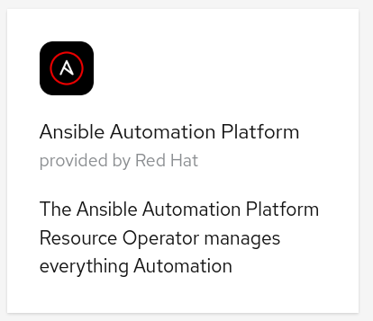
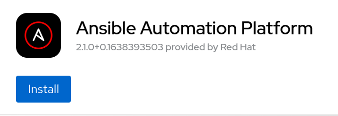
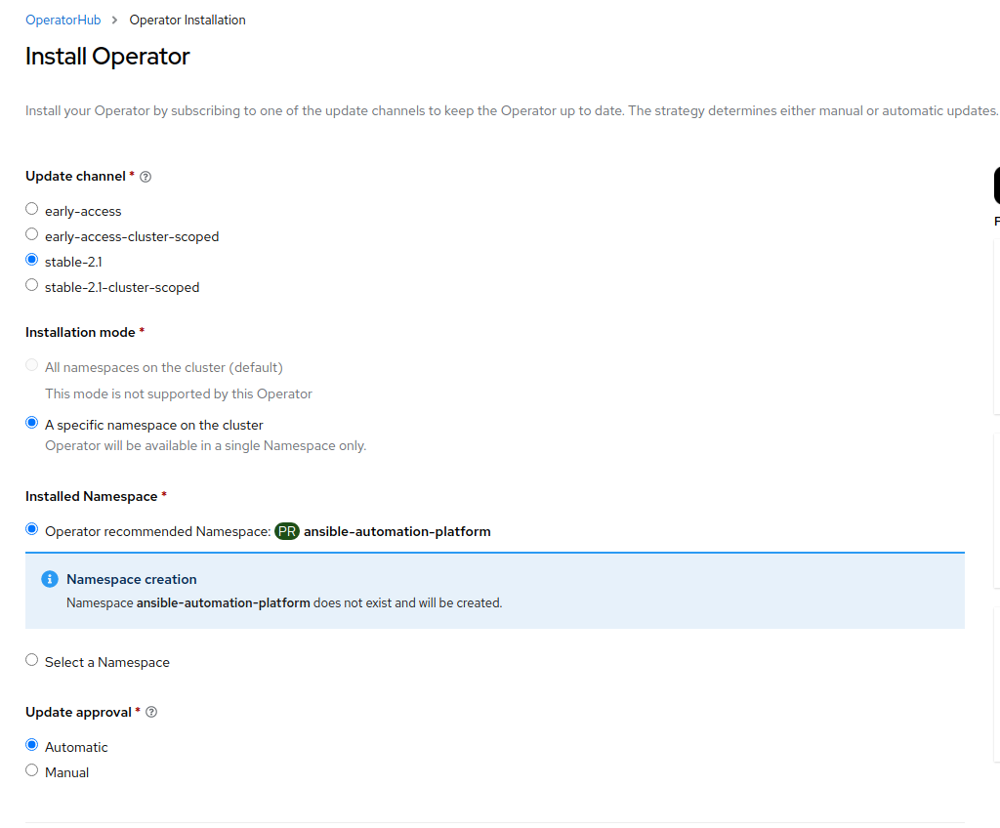

# How to deploy Ansible Automation Platform via the Operator on Code Ready containers

This is a quick how to deploy Ansible Automation platform locally on Code Ready Containers for a quick demo, or home lab.

## Definitions

[Red Hat CodeReady Containers aka CRC](https://developers.redhat.com/products/codeready-containers/overview) is a very easy to install local OpenShift cluster that runs on your laptop. This works for any operating system and can be downloaded from [here.](https://mirror.openshift.com/pub/openshift-v4/clients/crc/latest/)

## CRC Installation

Instructions to install crc are [here](https://access.redhat.com/documentation/en-us/red_hat_codeready_containers/1.35/html/getting_started_guide/installation_gsg)

TL;DR if you are on a mac you must be on 10.14 or above and you can just need to run crc binary you installed. (for Linux you will need to install libvirt via ```yum install virt-manager or apt if on debian``` and windows hyper-v must be enabled see install instructions above)

```shell
crc setup
```

Then to run it:

```shell
crc run
```

Once it is installed it should give you information to log in, however you can always retrieve this with:

```shell
crc console --credentials
```

## Installing the Ansible Automation Platform Operator

1. Once logged into the CRC/Openshift local instance click on OperatorHub on the left:


2. Type Ansible into the filter window and choose Ansible Automation Platform



3. Click install



4. Allow all the defaults and click install again

